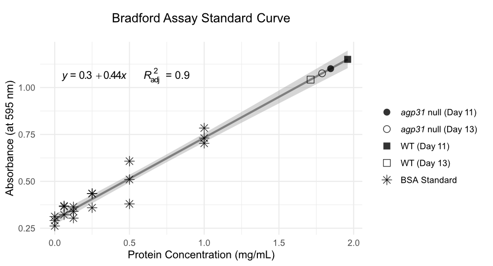
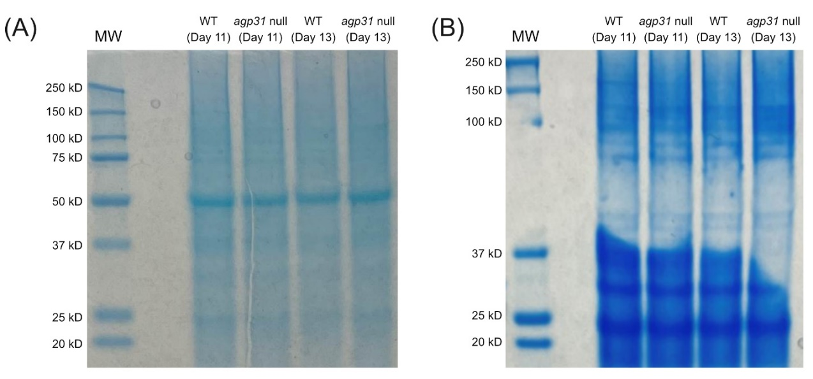
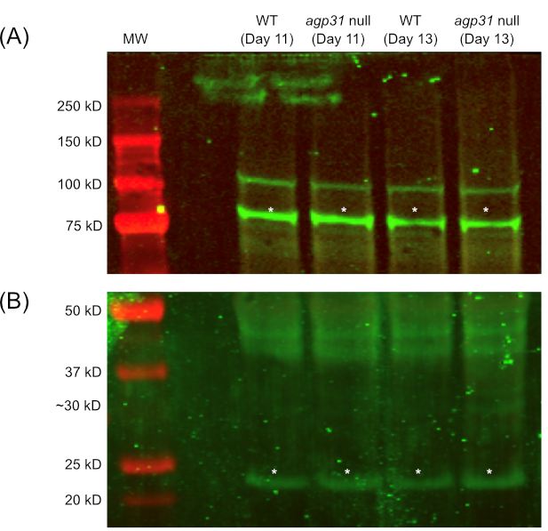
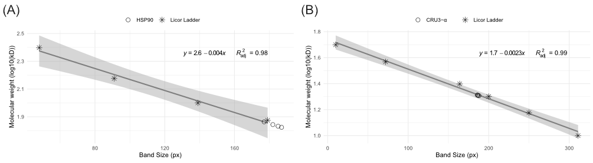
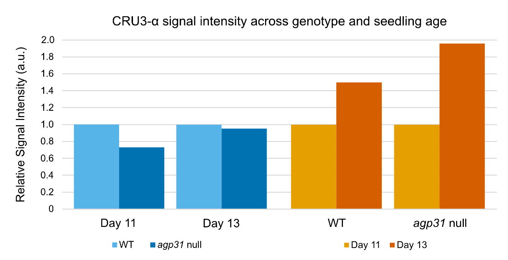

# Arabinogalactan protein 31 knockouts show typical levels of Cruciferin 3 α subunits, despite  insensitivity to the growth hormone abscisic acid  

 

# **Abstract**

A seed's transition from embryo to seedling is prompted by complex gradients of growth hormones, such as abscisic acid (ABA). In ABA insensitive plants, however, these developmental processes may proceed with unexpected downstream effects. One observed downstream effect in an ABA insensitive Arabinogalactan protein 31 null mutant line of *Arabidopsis thaliana* is the upregulation of Cruciferin 3 gene expression. Here, we use immunoblotting to identify CRU3-α subunits (or degraded fragments) in wild-type and *agp31* null mutant *A. thaliana* seedlings of varying ages (11 days, 13 days) to investigate whether CRU3 protein levels are also upregulated. Protein precipitation of whole seedlings produced high protein yields across all experimental samples. An SDS-PAGE revealed consistent protein integrity across experimental samples of a wide range of molecular weights. Western Blotting with CRU3-α antibodies displayed antigenic bands of approximately 20 kD, which is slightly smaller than the expected molecular weight of the antigen (30 kD). This suggests that CRU3-α subunits have reached an intermediate stage of degradation. The relative signal intensities of CRU3-α antigenic bands were consistent across wild type and *agp31* null mutant plants; however, both genotypes showed an increase in antigen signal from Day 11 to Day 13. Our results suggest that *agp31* null mutant plants are appropriately degrading CRU3
precursor proteins into CRU3-α subunits during the late embryo stage, supported by our identification of a degradation intermediate during early seedling growth. Thus, while *agp31* null mutant seedlings may upregulate CRU3 gene expression (perhaps due to inappropriate ABA signaling), they appear to retain appropriate function of pathways responsible for the transient degradation of CRU3 during early seedling growth. Future studies should use CRU3 antibodies rather than CRU3-α antibodies in order to identify a closer correlation between *CRU3* gene expression and the translation levels of the upregulated *CRU3* mRNAs.

 

# **Introduction**

In plants, germination is regulated by opposing levels of two hormones:
abscisic acid (ABA) and gibberellic acid (GA). The transition from seed
to seedling involves a shift from high levels of ABA and low levels of
GA to low levels of ABA and high levels of GA (Bouyer et al. 2011). This
shift in hormone levels cascades seedling growth pathways (e.g., root
and stem elongation), which require an abundant supply of nutrients.
Seed storage proteins (SSPs), such as cruciferin 3 (CRU3), are one such
source of nutrients. During late embryonic stages, SSPs are synthesized
and stockpiled; however, after germination, SSPs are degraded to provide
the growing plant with carbon, nitrogen, and sulfur. In the case of
CRU3, a larger precursor protein is transiently degraded into smaller α
and β subunits during late embryogenesis and throughout early seedling
growth.

Previous studies by Liu (2007) identified uncharacteristic upregulation
of *CRU3* gene expression in *agp31* null mutant lines of *Arabidopsis
thaliana* seedlings. Arabinogalactan protein 31 (AGP31) is a
proteoglycan located between the plasma membrane and cell walls of plant
cells that provides structural integrity to cell walls through
non-covalent scaffolding (Hijazi et al. 2014). *agp31* may also play a
non-trivial role in plant responses to ABA signaling. In their study,
Liu (2007) suggests that *agp31* null mutants are insensitive to ABA,
indicating that they are inefficient at producing appropriate ABA
responses. For example, agp31
mutant seeds grown in high concentrations of ABA had higher germination rates than their wild-type counterparts, potentially suggesting that mutant seeds enhanced their germination rates by degrading large quantities of ABA Thus, it
is possible that inappropriate ABA signaling may prevent the reduction
of ABA levels required for appropriate seed to seedling maturation,
which may have altered downstream regulation of *CRU3* expression.

In this study, we investigate whether levels of CRU3 proteins are also
elevated in *agp31* null mutants. Specifically, we use immunostaining to
identify CRU3 α-subunits (or degraded fragments) in wild type (Ler-0)
and *agp31* null mutant *A. thaliana* seedlings of varying ages (11
days, 13 days).

 

# **Results**

## *Seedling protein purification*

Seeds from two lines of *Arabidopsis thaliana* were used for this
analysis: a wild type (WT) line (Ler-0), and an *agp31* null mutant line
(6134). To determine how CRU3 protein levels progressed in growing
seedlings, two seedling ages were used in this analysis (Table 1). 

 

**Table 1. Experimental groups.**
|     Line     |     Genotype               |     Seedling Age    |               |
|--------------|----------------------------|---------------------|---------------|
|     Ler-0    |     wild type              |     Day 11          |     Day 13    |
|     6134     |     *agp31*   null mutant    |     Day 11          |     Day 13    |

 

Once seedlings reached their Day 11 and Day 13 growth stages, the
seedlings underwent acetone protein precipitation as described by
Deng et al. (2007). A Bradford Assay was used to quantify the stock
protein concentration using Bovine Serum Albumin (BSA) as a standard
(Figure 1). A linear regression was used to extrapolate the experimental
concentrations listed in Table 1. All four experimental samples had
similar stock concentrations ranging between 3.4-4.0 µg/µL.
Additionally, all samples had high protein yields, indicated by yield
ranges of 2.8-3.8 mg/mL (Table 1).

 

**Figure 1. Protein concentrations of WT and *agp31* null mutant seedlings.** Protein concentrations derived from a Bradford Assay using bovine serum albumin (BSA) as a standard.

 
 

**Table 2. Protein concentration, mass, volume, and yield of WT and <em>agp31</em> null mutant seedlings.** “Initial” and “remaining” refer to sample quantities before and after
the Bradford Assay, respectively.

|      Sample                     |     Stock protein   concentration      (µg/µL)    |     Initial volume     (µL)     |     Initial      protein mass      (mg)    |     Tissue mass      (g)    |     Protein yield     (mg/g)    |     Remaining volume     (µL)    |     Remaining   protein      (mg)    |
|---------------------------------|---------------------------------------------------|---------------------------------|--------------------------------------------|-----------------------------|---------------------------------|----------------------------------|--------------------------------------|
|     WT     (Day 11)             |     3.92                                          |     100.0                       |     0.3920                                 |     0.1029                  |     3.81                        |      94.0                        |     0.3685                           |
|     WT     (Day 13)             |     3.424                                         |     100.0                       |     0.3424                                 |     0.1218                  |     2.81                        |      94.0                        |     0.3219                           |
|     *agp31* null      (Day 11)    |     3.692                                         |     100.0                       |     0.3692                                 |     0.1194                  |     3.09                        |      94.0                        |     0.3470                           |
|     *agp31* null      (Day 13)    |     3.578                                         |     100.0                       |     0.3578                                 |     0.0977                  |     3.66                        |      94.0                        |     0.3363                           |

 

## *Analysis of SDS-PAGE and Western Blot Protein Transfer*

An SDS polyacrylamide gel electrophoresis (SDS-PAGE) was performed to
separate the proteins in the stock protein extractions by their
molecular weights. A 4-12% gradient gel was used to allow distinct
separation of high molecular weight proteins as well as low molecular
weight proteins. This type of separation was desired, since the CRU3-α
subunit has a low molecular weight (\~30 kD) (Li et al. 2006), whereas
the protein used for signal normalization (heat shock protein 90, HSP90)
has a larger molecular weight (\~90 kD) (Krishna and Gloor 2001).

The first gel was loaded with a ladder and experimental samples and was
stained with Coomassie blue with no further use (Figure 2A). An
additional gel was loaded with a ladder and experimental samples and was
prepared for Western Blotting. This second gel was stained with
Coomassie blue after Western blotting to visualize the amount of protein
that transferred onto the Western Blot membrane (Figure 2B).

Figure 2 supports proteins migrated well in both gels, since the
molecular weight (MW) ladder bands separated clearly without excessive
smearing or bulging of bands. The experimental samples in both gels
appear to have equal loading of proteins, indicated by the visually
consistent band brightness across all lanes. Additionally, there is no
apparent difference in the range of protein size visible across
genotypes, since all samples have similar protein integrity based on
protein staining.

Lastly, Figure 2B supports that high MW proteins (\>100 kD) did not
transfer well to the membrane, which is expected due to physical
limitations of movement through polyacrylamide pores. Proteins between
30-100 kD migrated out of the gel extremely well. Lastly, low MW
proteins (\< 30 kD) did not transfer to the membrane as well as the
moderately sized proteins, likely due to the higher polyacrylamide
percentage towards the bottom of the gel.

 

**Figure 2. Coomassie stained gels.** Staining occurred immediately after SDS-PAGE without protein transfer for Western Blot (A). Staining occurred after proteins transferred onto membrane for Western Blot (B).

 

## *Molecular Weights of HSP90 and CRU3-α Antigens*

Before performing the Western Blot, HSP90 antibodies and CRU3-α
antibodies were added to the membrane associated with the gel pictured
in Figure 2B. The Western Blot pictured in Figure 3A supports that HSP90
antibodies bound to HSP90 antigens across all four experimental samples,
which is expected, since HSP90 is constitutively expressed in *A.
thaliana* (Krishna and Gloor 2001). Figure 3B supports that CRU3-α
antibodies successfully bound to CRU3-α antigens in all experimental
samples. A linear regression was used to extrapolate the MWs of the
HSP90 and CRU3-α antigenic bands based on the known MWs of the ladder
(Figure 4). The HSP90 antigenic bands of interest were approximately 70
kD, while the CRU3-α antigenic bands of interest were approximately 20
kD (Table 3).

 

  
**Figure 3.** **Western blot using HSP90 antibodies (A) and CRU3-α antibodies (B).** Molecular weight (MW) ladder loaded onto left-most lane. Remaining lanes correspond to experimental seedling samples. Bands marked with asterisks denote the respective antigenic band of interest (i.e., HSP90 (A), CRU3-α (B)).

 
 

**Figure 4. Molecular weight standard curves of HSP90 (A) and CRU3-α (B) antigenic bands from Western Blot displayed in Figure 3.** 

 

**Table 3. Estimated molecular   weights of HSP90 and CRU3-α antigenic bands from Western Blot.**
| Antigen |     Molecular Weight (kD)    |
|---------|------------------------------|
| HSP90 | 70  |
| CRU3-α | 20 |
 

## *CRU3-α signal intensity across seedling age and genotype*  
To determine whether levels of the CRU3-α antigen differed across
genotypes and seedling age, band signals were measured and subsequently
normalized according to the relative signal quantitation procedure
described by an Invitrogen technical note. There does not appear to be a
significant difference of CRU3-α signal intensity across wild type and
*agp31* null mutants (Figure 5). From Day 11 to Day 13, both genotypes
show an increase in CRU3-α signal intensity, which is slightly more
pronounced in *agp31* null mutants.

**Figure 5. CRU3-α signal intensity across genotype (left) and seedling age (right).**                                             

 

# **Discussion**

Our protein purification methods had high protein yields across all samples, indicated by yield ranges of 2.8-3.8 mg/mL (Table 1). Our Coomassie stained gels support that there is not an apparent difference in the range of protein size visible across genotypes, since all samples have similar protein integrity based on protein staining.

The antigenic band sizes described in Table 3 appear to be slightly inconsistent with previously reported molecular weights. The estimated MW of the HSP90 and CRU3-α antigens are both approximately 10 kD smaller than expected. A 10 kD inconsistency for the HSP90 antigen may be expected due to lower gel precision for higher MWs (Mona Mehdy, personal communication). However, the 10 kD inconsistency for the CRU3-α antigen suggests that some protein degradation or cleavage may have occurred during the experimental protocol. Subsequent replications of this experiment could attempt to add more protease inhibitors to the lysis buffer to avoid unintended protein degradation, as recommended by the Bio-Rad Western Blot troubleshooting page, or attempt to keep samples on ice even further to prevent degradation by heat.

Previous studies by Liu (2007) identified uncharacteristic upregulation of *CRU3* gene expression in vegetative tissue of *agp31* null mutant seedlings. Here, we conclude that we did not see an analogous increase in CRU3 protein expression in *agp31* null mutant seedlings, regardless of seedling age. Because SSPs, such as CRU3, are degraded during late embryogenesis to fuel germination, the presence of relatively consistent levels of CRU3-α subunits across both genotypes indicates that CRU3 precursor proteins are appropriately being degraded into their smaller subunits throughout seedling ages of 11 and 13 days. Thus, while *agp31* null mutant seedlings may upregulate CRU3 gene expression (perhaps due to inappropriate ABA signaling), they appear to retain appropriate function of pathways responsible for the transient degradation of SSPs such as CRU3 during early seedling growth. This is supported by comparable patterns of CRU3-α signals across wild type and mutant sample. To validate these conclusions, this experiment should be repeated with more biological replicates, since the current data only includes one replicate per genotype per seedling age, which is insufficient for drawing comprehensive biological conclusions. Additionally, future renditions of this experiment should use CRU3 antibodies rather than CRU3-α antibodies in order to identify a closer correlation between *CRU3* gene expression and the translation levels of
the upregulated *CRU3* mRNAs.

 

# **References**

Bio-Rad. Western Blot Troubleshooting: Unusual or Unexpected Bands.
https://www.bio-rad-antibodies.com/western-blot-troubleshooting.html

Bouyer D, Roudier F, Heese M, Andersen ED, Gey D, Nowack MK, Goodrich J,
Renou J-P, Grini PE, Colot V, et al. 2011. Polycomb Repressive Complex 2
Controls the Embryo-to-Seedling Phase Transition. Copenhaver GP, editor.
PLoS Genetics. 7(3):e1002014.
doi:https://doi.org/10.1371/journal.pgen.1002014.

Deng Z, Zhang X, Tang W, Oses-Prieto JA, Suzuki N, Gendron JM, Chen H,
Guan S, Chalkley RJ, Peterman TK, et al. 2007. A Proteomics Study of
Brassinosteroid Response in Arabidopsis. Molecular & Cellular
Proteomics. 6(12):2058--2071.
doi:https://doi.org/10.1074/mcp.m700123-mcp200.

Hijazi M, Roujol D, Nguyen-Kim H, del Rocio Cisneros Castillo L, Saland
E, Jamet E, Albenne C. 2014. Arabinogalactan protein 31 (AGP31), a
putative network-forming protein in Arabidopsis thaliana cell walls?
Annals of Botany. 114(6):1087--1097.
doi:https://doi.org/10.1093/aob/mcu038.
https://www.ncbi.nlm.nih.gov/pmc/articles/PMC4195544/.

Krishna P, Gloor G. 2001. The Hsp90 family of proteins in Arabidopsis
thaliana. Cell Stress & Chaperones. 6(3):238--246.
https://www.ncbi.nlm.nih.gov/pmc/articles/PMC434405/.

Li L, Shimada T, Takahashi H, Ueda H, Fukao Y, Kondo M, Nishimura M,
Hara-Nishimura I. 2006. MAIGO2 Is Involved in Exit of Seed Storage
Proteins from the Endoplasmic Reticulum in *Arabidopsis thaliana*. The
Plant Cell. 18(12):3535--3547.
doi:https://doi.org/10.1105/tpc.106.046151.

Liu C. 2007. CHARACTERIZATION AND FUNCTIONAL ANALYSIS OF ARABINOGALACTAN
PROTEIN 31 IN ARABIDOPSIS.
https://repositories.lib.utexas.edu/bitstream/handle/2152/3743/liuc81273.pdf.
