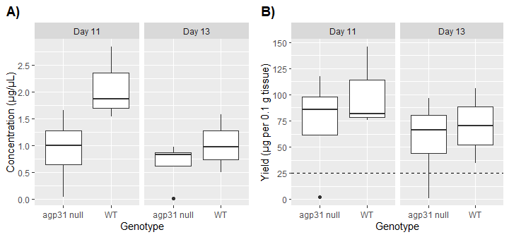

# Investigating the expression of seed storage protein genes in *Arabidopsis thaliana* seedlings that lack a functional Arabinogalactan protein 31

 

# **Abstract**

A seed's transition from embryo to seedling is prompted by complex gradients of growth hormones, such as abscisic acid (ABA). In ABA insensitive plants, however, these developmental processes may proceed with unexpected downstream effects. One observed downstream effect in an ABA insensitive Arabinogalactan protein 31 (*agp31*) null mutant line of *Arabidopsis thaliana* is the upregulation of seed storage protein gene expression in seedlings. Here, we use real-time quantitative PCR (RT-qPCR) to compare the relative expression of two seed storage protein genes (i.e., Cruciferin 3 (*CRU3*) and Oleosin 1 (*OLE1*)) in *agp31* mutant seedlings, relative to wild-type seedlings across varying ages (11 days, 13 days). Total RNA isolation of whole seedlings produced high quality yields across all but two samples. Gel electrophoresis confirmed minimal RNA degradation during isolations. We constructed cDNA libraries from our isolations and confirmed that our *CRU3* and *OLE1* primers had at least 90% duplication efficiency. Melting curves from RT-qPCR confirmed a single target amplification in all samples, for each gene. Our results support a significant decrease in *OLE1* expression in Day 13 *agp31* null mutant seedlings (p \< 0.01). We cannot reject that the levels of *OLE1* expression differ between Day 11 *agp31* null mutants and wild-types, or that the levels of *CRU3* expression differ between Day 11 or Day 13 seedlings of either genotype (p \> 0.01). Our results do not support previous findings from analogous *A. thaliana* experiments.

 

# **Introduction**

In plants, germination is regulated by opposing levels of two hormones: abscisic acid (ABA) and gibberellic acid (GA). The transition from seed to seedling involves a shift from high levels of ABA and low levels of GA to low levels of ABA and high levels of GA (Bouyer et al. 2011). This shift in hormone levels cascades seedling growth pathways (e.g., root and stem elongation), which require an abundant supply of nutrients. Seed storage proteins (SSPs), such as Cruciferin 3 (CRU3) and Oleosin 1 (OLE1), are one such source of nutrients. During late embryonic stages, SSPs are synthesized and stockpiled; however, after germination, SSPs are degraded to provide the growing plant with carbon, nitrogen, and sulfur.

Previous studies by Liu (2007) identified uncharacteristic upregulation of *CRU3* gene expression in *agp31* null mutant lines of *Arabidopsis thaliana* seedlings. Arabinogalactan protein 31 (AGP31) is a proteoglycan located between the plasma membrane and cell walls of plant cells that provides structural integrity to cell walls through non-covalent scaffolding (Hijazi et al. 2014). AGP31 may also play a non-trivial role in plant responses to ABA signaling. In their study, Liu (2007) suggests that *agp31* null mutants are insensitive to ABA, indicating that they are inefficient at producing appropriate ABA responses. For example, *agp31* mutant seeds grown in high concentrations of ABA had higher germination rates than their wild-type counterparts, potentially suggesting that mutant seeds enhanced their germination rates by degrading large quantities of ABA. Additionally, previous studies identified that thirteen-day-old *agp31* null mutant seedlings showed peaked levels of elevated *CRU3* and *OLE1* mRNAs, compared to wild-type seedlings of the same age (Mona Mehdy, personal communication). It is possible that inappropriate ABA signaling may have facilitated the ABA degradation, therefore promoting seed to seedling maturation, which may have altered downstream upregulation of the expression of seed storage protein genes.

In this study, we investigate whether levels of *CRU3* and *OLE1* gene expression are also elevated in *agp31* null mutant seedlings. Specifically, we use real-time quantitative PCR to measure the relative expression of our genes of interest in wild type (Ler-0) and *agp31* null mutant *A. thaliana* seedlings of varying ages (11 days, 13 days).

 

# **Results**

## *1.0 Seedling preparation*

To investigate the effect of knocking out *agp31* on SSP gene expression
in *Arabidopsis thaliana*, we compared seedlings from an *agp31* null
mutant line (6134) to a wild type (WT) line (Ler-0). To compare how SSP
gene expression changes across the two genotypes during early seedling
growth, we grew seedlings to varying ages described in Table 1.

 

**Table 1. Experimental groups used in this analysis.**

|  **Line** | **Genotype**  | **Seedling Age** | **Biological Replicates** |
| --- | --- | --- | --- |
|  Ler-0 |         wild type            | Day 11           | 3 |
|  Ler-0 |         wild type            | Day 13           | 3 |
|  6134  |         *agp31* null mutant  | Day 11           | 4 |
|  6134  |         *agp31* null mutant  | Day 13           | 4 |

Seedlings were grown in identical conditions until they reached their
experimental ages. Once seedlings reached their Day 11 and Day 13 growth
stages, tissue samples were harvested and weighed. The masses of
collected seedling tissues are displayed in Figure 1. Generally, less
tissue was collected from the mutant seedlings; however, this does not
appear to negatively affect subsequent analyses.

 

**Figure 1. Boxplot of the distribution of seedling tissue masses used in our experimental protocol.**

 

## *2.0 Total RNA isolation*

From the collected tissue specimens, we isolated total RNA from the seedlings using the NucleoSpin® RNA Plant and Fungi kit (Macherey-Nagel, Düren, Germany) with modifications. RNA concentration was quantified using a NanoDrop™ spectrophotometer, and corresponding concentrations are displayed in Figure 2A. Two of the mutant samples (one Day 11, one Day 13) had concentrations less than 0.05 µg/µL, which were insufficient for subsequent analyses. As a result, subsequent RNA work has three
biological replicates of each experimental group. Additionally,
excluding the two problematic samples, our RNA isolations had yields that were higher than the expected yields (i.e., 25 µg/0.1 g tissue), which are displayed on Figure 2B (Mona Mehdy, personal communication).

 

**Figure 2. Quantification of total RNA isolations.** Total RNA concentration shown in (A), while total RNA yield shown in (B). In (B), the dotted line represents the expected yield of 25 µg/0.1 g tissue.

 

Next, we assessed the quality of our RNA isolations using spectral
ratios measured with the NanoDrop™ spectrophotometer. Other than one of the problematic samples, our RNA isolations show low residual protein and carbohydrate contaminants, supported by absorbance values greater than 1.8 (Figure 3). The low 260/230 nm absorption for the Day 11 *agp31* null mutant in Figure 3B may be due to residual salts from the isolation buffers that were not properly eliminated during centrifugation.

 

  
**Figure 3. Boxplots show the distribution of spectral ratios of total RNA isolations.** Purity from residual proteins is shown in (A), while purity from residual carbohydrates is shown in (B). Dotted lines represent the minimum acceptable absorption ratio of 1.8.

 

Lastly, we used gel electrophoresis to examine the extent of degradation of our RNA isolations (Figure 4). It is worth mentioning that the amount of RNA loaded into each lane does not appear to be consistent, since some replicates appear much brighter than others despite allegedly loading 1.00 µg of RNA into each lane (e.g., lane 8 vs. lane 9), likely
due to pipetting or calculation error. The lack of smearing on the right side of gel (i.e., low molecular weight RNAs) supports that our isolation protocol minimized RNA degradation. Additionally, since most cells have approximately equal stoichiometry of 28S and 18S rRNAs, we
expect each replicate to have this stoichiometry in the absence of
excessive RNA degradation. As expected, for each replicate, we see
approximately equal band brightness for the 28S and 18S rRNAs, which supports that the isolation protocol minimized degradation. We proceed with confidence that we isolated high-quality RNA from sufficient replicates of each experimental group (i.e., 3).

 
 

  

**Figure 4. Gel electrophoresis of RNA isolations.** Each lane on the gel is a replicate described by the Genotype and Age columns. In lanes 12-15, the asterisks denote that the replicate was loaded in varying amounts. The wells are located on the left-most side of the gel, and 28S and 18S rRNA bands are labeled at the top of the gel. 

 

## *3.0 Relative expression of CRU3 and OLE1 mRNAs*

### *3.1 cDNA library preparation*

To assess the relative difference in expression of *CRU3* and *OLE1* mRNA in our experimental groups, we prepared our RNA isolations for real time quantitative PCR (RT-qPCR). We first developed complementary DNA (cDNA) libraries using our RNA isolations as templates. In total, each experimental group had three cDNA library replicates, along with a single cDNA library that was constructed without reverse transcriptase
(-RT) to account for the baseline level of genomic DNA present in our RNA isolations.

 

### *3.2 Primer standardization*

Next, we selected *CRU3* and *OLE1* primers for RT-qPCR amplification
based on research conducted in a previous semester. Primer
standardization was performed by measuring the amount of replication
cycles required to surpass a critical fluorescence threshold at a range
of initial template amounts. Figure 5 shows that the *CRU3* primer that
we selected has a linear relationship between the log10-fold increase in
the amount of initial template and the number of cycles required to
surpass the critical threshold. Additionally, the linear regression
supports that for each log10-fold increase in template, the number of
cycles required to surpass the critical threshold decreases by 3.195 ±
0.071 cycles, which is expected for a primer with at least 90%
duplication efficiency. Lastly, this linear model explains approximately
99.5% of the variation in our data, which supports that our selected
primer is consistent. Altogether, this evidence supports that the primer
that we selected for *CRU3* amplification successfully duplicates an
acceptable amount of the template present at the beginning of each
replication cycle. Albeit not shown here, similar properties were
observed for the primer selected for *OLE1* amplification.

 

**Figure 5. Primer standardization curve for the RT-qPCR amplification of *CRU3* cDNA.**

 

### *3.3 RT-qPCR reactions*

In addition to our two genes of interest, we prepared reactions to
amplify Actin 2 (*ACT2*), a gene commonly used as a baseline for gene expression due to its relatively consistent expression in *A. thaliana* (Czechowski et al. 2005). We also included a control reaction without cDNA for each gene to confirm the absence of DNA contamination in the water used to prepare the RT-qPCR reaction mixtures. After running RT-qPCR, we removed critical threshold values that were outliers within each technical replicate (i.e., valid cycle thresholds must be within ± 0.5 cycle thresholds of the median value of each technical replicate). Figure 6 illustrates the final sample sizes for each experimental group and gene after eliminating outliers.

 

  
**Figure 6. Sample sizes of valid RT-qPCR cycle threshold values, after removing outliers.** Sample sizes include both biological and technical replicates.

 

Cycle thresholds for control reactions without cDNA templates were all undetermined, which supports that our template reactions remained uncontaminated. All but one -RT reaction had undetermined cycle thresholds, which suggests that our RNA isolations had low amounts of residual genomic templates. The one -RT reaction that was not undetermined was at least 5 cycle thresholds greater than its +RT counterpart, which is still acceptable for concluding that low levels of genomic templates were present. Reaction melting curves for template reactions showed a single peak, as expected when a single template is
amplified.

Lastly, the cycle thresholds of *ACT2* expression across all samples were within an acceptable range of approximately 19-22 (Mona Mehdy, personal communication). With this baseline expression established, we continued with our analysis of relative changes in *CRU3* and *OLE1* gene expression across all experimental groups.

 

### *3.4 Relative changes in CRU3 and OLE1 gene expression*

Our analysis of relative gene expression from RT-qPCR data is derived from Livak and Schmittgen (2001). We first calculated changes in cycle thresholds (i.e., ΔCT) by subtracting the average *ACT2* cycle threshold from the average cycle threshold of the gene of interest within each biological replicate. Next, for *CRU3* and *OLE1*, we computed the changes in ΔCT (i.e., ΔΔCT) by subtracting the average ΔCT of the wild-type samples from the ΔCT of each null mutant, with respect to seedling ages. Lastly, fold-changes in expression relative to the wild-type seedlings were computed using the equation: *2^‒ΔΔCT^*. Table 2 and Figure 7 display the average fold-changes in *CRU3* and *OLE1* gene expression across wild-type (WT) and *agp31* null mutants at varying seedling ages.

 
 

**Table 2. Average fold-changes in *CRU3* and *OLE1* gene                                                expression across wild-type (WT) and *agp31* null mutant seedlings at varying seedling ages.** Dashes indicate that only a single sample was present in the group, so SEM could not be computed.

| Gene | Genotype | Age | Mean fold-change | SEM fold-change | Sample size |
| -- | -- | -- | -- | -- | -- |
| *CRU3* | *agp31* null | Day 11 | 0.82 | 0.56 | 3 |
| *CRU3* | *agp31* null | Day 13 | 2.39 | 0.84 | 4 |
| *CRU3* | WT           | Day 11 | 1.00 | ‒    | 1 |
| *CRU3* | WT           | Day 13 | 1.01 | 0.14 | 2 |
| *OLE1* | *agp31* null | Day 11 | 0.52 | 0.04 | 2 |
| *OLE1* | *agp31* null | Day 13 | 0.10 | 0.02 | 2 |
| *OLE1* | WT           | Day 11 | 1.01 | 0.15 | 2 |
| *OLE1* | WT           | Day 13 | 1.00 | 0.02 | 2 |

 
 

  

**Figure 7. Comparing fold-changes in expression of *CRU3* and *OLE1* relative to wild-type seedlings.** Bars represent the SEM.

 

Lastly, a two-tailed t-test was performed to compare the expression of our genes of interest in *agp31* null mutants to the expression in wild-type seedlings at a significance level of α = 0.01 (Table 3). For each gene and seedling age, the hypotheses tested are as follows:

H0: fold-change of WT = fold-change agp31 null

HA: fold-change of WT ≠ fold-change agp31 null

 
 

**Table 3. Comparing differences in expression at a significance level of α = 0.01.** The CRU3 Day 11 comparison could not be performed, since one of the groups had a sample size of 1 and therefore did not have a variance.                                     

|  Gene                    | Age                     | p-value |
| -- | -- | -- |
|  *CRU3*                  | Day 11                  | ‒       |
|  *CRU3*                  | Day 13                  | 0.199   |
|  *OLE1*                  | Day 11                  | 0.165   |
|  *OLE1*                  | Day 13                  | \*0.002 |

 
 

# **Discussion**

Based on prior research, we hypothesized that *agp31* mutant seedlings
would continue to over-express both SSP genes during their Day 11 and
Day 13 stages of early seedling growth. Our results support a
significant decrease in *OLE1* expression in Day 13 *agp31* null mutant
seedlings (p \< 0.01). We cannot reject that the levels of *OLE1*
expression differ between Day 11 *agp31* null mutants and wild-types, or
that the levels of *CRU3* expression differ between Day 11 or Day 13
seedlings of either genotype (p \> 0.01). However, it is worth
mentioning that there were dilution issues during the RNA isolation
protocol for the *agp31* mutant with low *OLE1* expression (biological
replicate No. 4). This sample was over-diluted during the elution step,
which suggests that over-dilution may have misrepresented the amount of
template present at the beginning of RT-qPCR. Though, it does not seem
like the *ACT2* and *CRU3* cycle thresholds for this sample show signs
of over-dilution.

Aside from technical issues, it remains unclear as to why our results
would be inconsistent with previous research. It appears that this
experimental protocol works well for producing cDNA libraries for the
RT-qPCR analysis of *CRU3* and *OLE1* expression, in the absence of
human error. Some errors that we encountered throughout this experiment
largely reduced our initial sample sizes, making it difficult to make
convincing claims about the biological implications of our results.
Future implementations of this experiment should continue using a
similar protocol to produce more data for each experimental group, to
increase the confidence in which we claim to observe significant
differences in SSP gene expression across genotypes and seedling ages.

 
 

# **References**

Bouyer D, Roudier F, Heese M, Andersen ED, Gey D, Nowack MK, Goodrich J,
Renou J-P, Grini PE, Colot V, et al. 2011. Polycomb Repressive Complex 2
Controls the Embryo-to-Seedling Phase Transition. Copenhaver GP, editor.
PLoS Genetics. 7(3):e1002014.
doi:https://doi.org/10.1371/journal.pgen.1002014.

Czechowski T, Stitt M, Altmann T, Udvardi MK, Scheible W-R. 2005.
Genome-Wide Identification and Testing of Superior Reference Genes for
Transcript Normalization in Arabidopsis. Plant Physiology. 139(1):5--17.
doi:https://doi.org/10.1104/pp.105.063743.

Hijazi M, Roujol D, Nguyen-Kim H, del Rocio Cisneros Castillo L, Saland
E, Jamet E, Albenne C. 2014. Arabinogalactan protein 31 (AGP31), a
putative network-forming protein in Arabidopsis thaliana cell walls?
Annals of Botany. 114(6):1087--1097.
doi:https://doi.org/10.1093/aob/mcu038.
https://www.ncbi.nlm.nih.gov/pmc/articles/PMC4195544/.

Liu C. 2007. CHARACTERIZATION AND FUNCTIONAL ANALYSIS OF ARABINOGALACTAN
PROTEIN 31 IN ARABIDOPSIS.
https://repositories.lib.utexas.edu/bitstream/handle/2152/3743/liuc81273.pdf.

Livak KJ, Schmittgen TD. 2001. Analysis of Relative Gene Expression Data
Using Real-Time Quantitative PCR and the 2−ΔΔCT Method. Methods.
25(4):402--408. doi:https://doi.org/10.1006/meth.2001.1262.

‌
